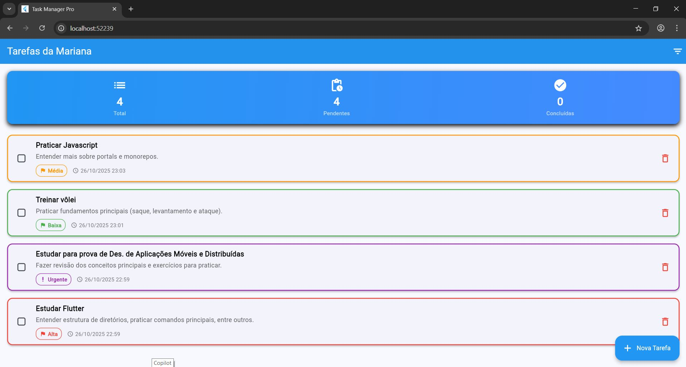

# Flutter Interface
The goal is to build a simple to-do list app with a cool interface, screen navigation, forms with validation, and good UX/UI practices, using Flutter's Material Design 3 standard.

---

## 📂 Estrutura do repositório

* `/code` - Contains all the source code for the Flutter application.
* `/docs` - Contains the documentation used as a basis.
* `/screenshots` - Contains screenshots and visual demonstrations of the project.